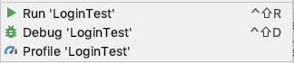
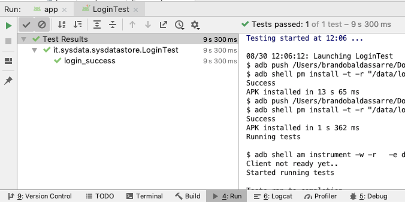
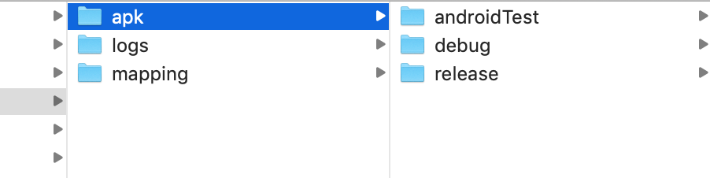
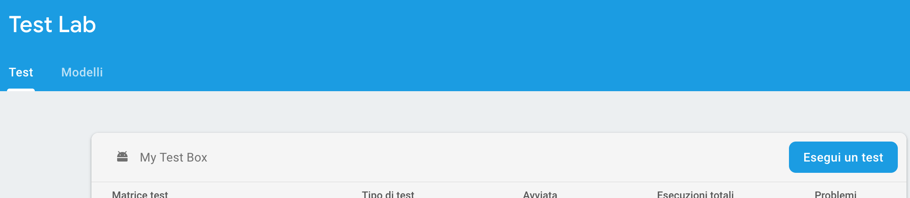
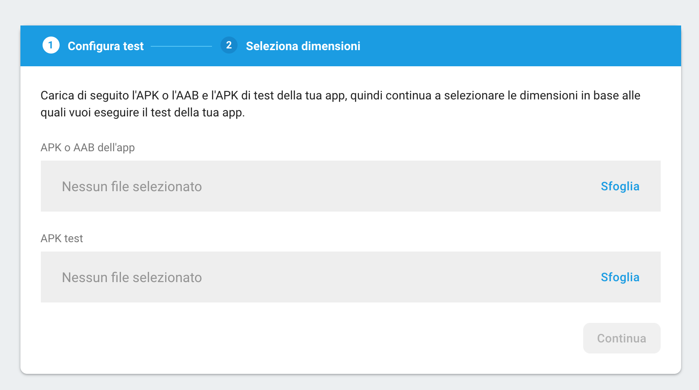
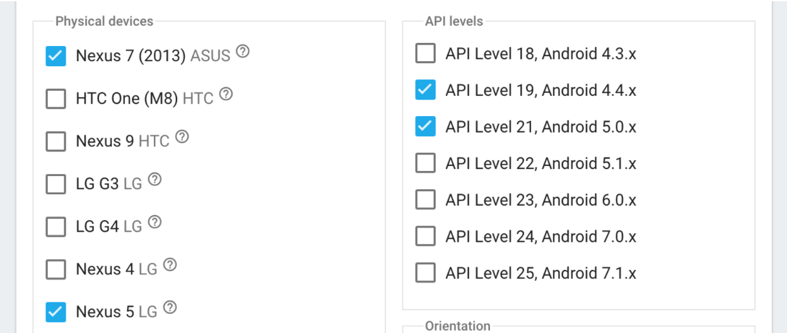
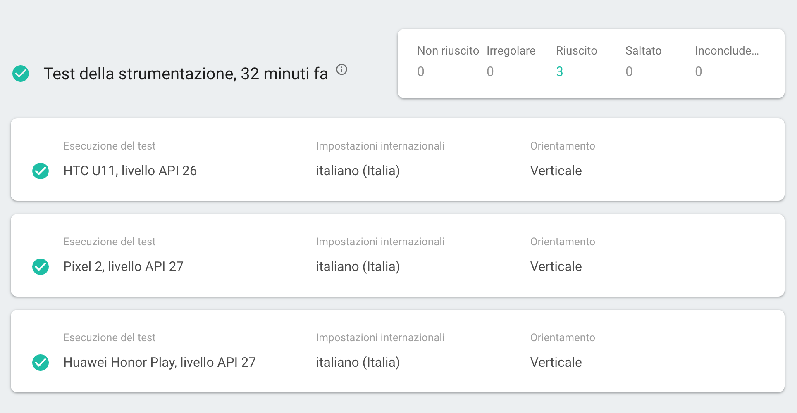
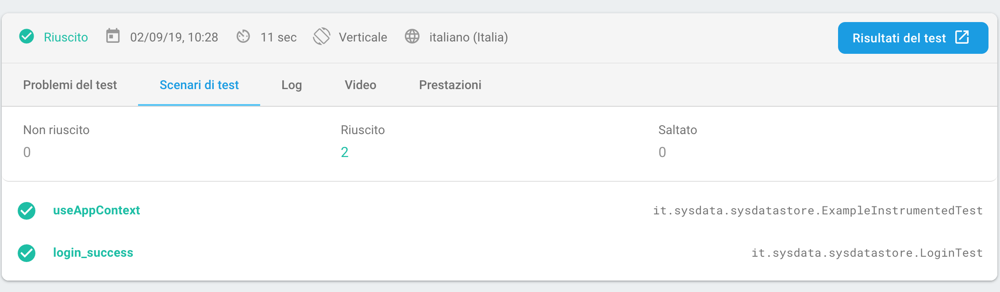

# UI Instrumented Tests

### 1 Intro
The aim of the document is to provide base indications on UI automated tests.
At the moment of writing, Google suggests to use two frameworks:
* Espresso
* UI Automator

In the following paragraphs, I'll describe an example of a test executed with Espresso.

### 2.1 Preliminary actions
Gradle dependencies

```gradle
android.defaultConfig {
 testInstrumentationRunner "androidx.test.runner.AndroidJUnitRunner"
 // (sostituisce testImplementation "junit:junit:$junit_version")
}
dependencies {
androidTestImplementation "androidx.test:runner:$testrunner_version"
androidTestImplementation "androidx.test.espresso:espresso-core:$espresso_version"
androidTestImplementation 'androidx.test:rules:$testrules_version'
}
```

### 2.2 Simulator configuration
On the target device, go to "Settings > System > developer options" and disable the following options:
Window animation scale
Transition animation scale
Animator duration scale

### 2.3 Test configuration
UI test classes must be placed inside the "androidTest" package.
Inside the single file, we'll have to place some annotations:
Above the class signature

```kotlin
@RunWith(AndroidJUnit4::class)

@LargeTest
class LoginTest {
    // ...
}
```

Above the variable containting rules.

```kotlin
@Rule
@JvmField
public val rule = getRule()
```

Above the method that is executed before all other tests present inside the class.

```kotlin
@BeforeClass
@JvmStatic
fun before_class_method() {

}
```

Above the method that is executed after all other tests present inside the class.

```kotlin
@AfterClass
@JvmStatic
fun after_class_method() {

}
```

Above the method that is executed before each and every single test inside the class

```kotlin
@Before
fun before_test_method() {

}
```

Above the method that is executed after each and every single test inside the class

```kotlin
@After
fun after_test_method() {

}
```

Above the methods that contain the real test.

```kotlin
@Test
fun login_success() {

}
```

Inside the test in the example, we wanted to target the login UI. The class structure is `LoginActivity` > `LoginFragment`.
In our rules definition (`@Rule`), we retrieved the target Activity:

```kotlin
private fun getRule(): ActivityTestRule<LoginActivity> {
   Log.e("Initalising rule","getting LoginActivity")
   return ActivityTestRule(LoginActivity::class.java)
}
```

In this case, within the Activity, there is automatic loading of the Fragment via NavGraph; this leads to having direct access to all the views present in the fragment without having to instantiate it.

The configuration is finished. Now let's move on to implementing the test.

### 3 @Test
First, let's determine what we need to test.
The login screen has 3 form-fields and a button; the latter is enabled only if all 3 fields are filled out.
The usecase expects to check the status of the button every time a form field is filled.

Here is the snippet of a test:

```kotlin
@Test
fun login_success() {

   Thread.sleep(1000);
   onView((withId(R.id.usernameEditText))).perform(click())
   onView(withId(R.id.usernameEditText))
       .perform(setTextInSDEditText(username_tobe_typed))

   onView(withId(R.id.loginButton)).check(matches(not(isEnabled())));

   Thread.sleep(1000);
   onView((withId(R.id.passwordEditText))).perform(click())
   onView(withId(R.id.passwordEditText))
       .perform(setTextInSDEditText(correct_password))
       .perform(closeSoftKeyboard())

   onView(withId(R.id.loginButton)).check(matches(not(isEnabled())));

   Thread.sleep(1000);
   onView(withId(R.id.termsAndConditionCheckBox)).perform(click())

   onView(withId(R.id.loginButton)).check(matches(isEnabled()));

   Thread.sleep(1000);
   onView(withId(R.id.loginButton))
       .perform(click())

   Thread.sleep(1000);
}
```

Briefly, the actions that are performed in the test are:


Recreate the view -> `onView()`

The `onView()` method allows you to select one or more Views that respect the conditions expressed as an argument. In the example, the condition is `withId()` which allows to identify the View with a given ID.
There are many ways to select the views.

Perform actions on a selected view -> `perform()`

The `onPerform()` method replaces the user interaction with the device. Allows you to modify the selected view. It is therefore possible to insert texts, click, scroll a list, close the keyboard, etc.
There are default methods for standard Android views but it is also possible to create custom actions in case you want to interact with a view created ad hoc. This last operation was performed in the `SdEditTextUtils` class to insert the text inside the `EditText` nested inside the custom view `SDEditText`

Perform assertions after one or more actions -> `check()`

The `check()` method allows to check assertions that we defined during the test analysis. The assertion check is passed as a method argument and can be customized in order to understand all the possible scenarios.
In our example, the assertion is that the button is enabled only if all the three form fields are not empty. If an assertion fails, the entire test fails.

### 4 RUN
Once the test has been written, the run must be performed.
Right click on the class of the test and click on "Run '<ClassName>'" or on "Debug '<ClassName>'"



The "Run" tab will contain all the information relating to the compilation and run of the test.
In case of failure, the relevant logs will be shown.



### 5 Firebase
Firebase allows to run tests on a variety of devices in an automated way providing the following feedbacks
* esito dei test
* video dei test
* log del dispositivo durante l’esecuzione dei test
* prestazioni dei test

These automations are subject to subscription or payment based on consumption.
Performing tests from the console is quite simple; the only modification necessary is to insert, in the gradle file, the applicationId of the test APK. In this way, after compiling the test and the APK, both APKs will be created in the "build > outputs > apk" directory which will be used during the test configuration in the Firebase console.

```gradle
defaultConfig {
   // ...
   // Specifies the application ID for the test APK.
   testApplicationId "it.sysdata.sysdatastoreTest"
   // Specifies the fully-qualified class name of the test instrumentation runner.
   testInstrumentationRunner "it.sysdata.sysdatastoreInstrumentationTest"
}
```


Enter the "Test Lab" section and click on "Run a Test" then select the "Run an instrument test" option



In the following screen, it will be requested to insert the original APK and the test APK.



After clicking on "Continue", it will be requested to select the target devices that will run the tests.



The test configuration is completed. Now we can see the result.
In the test screen, we'll be able to see all the selected devices of the previous screen. Clicking upon each of the devices, it will be possible to see the specific results.



As explained before, inside a single result, it is possible to view all the information of a single test.

